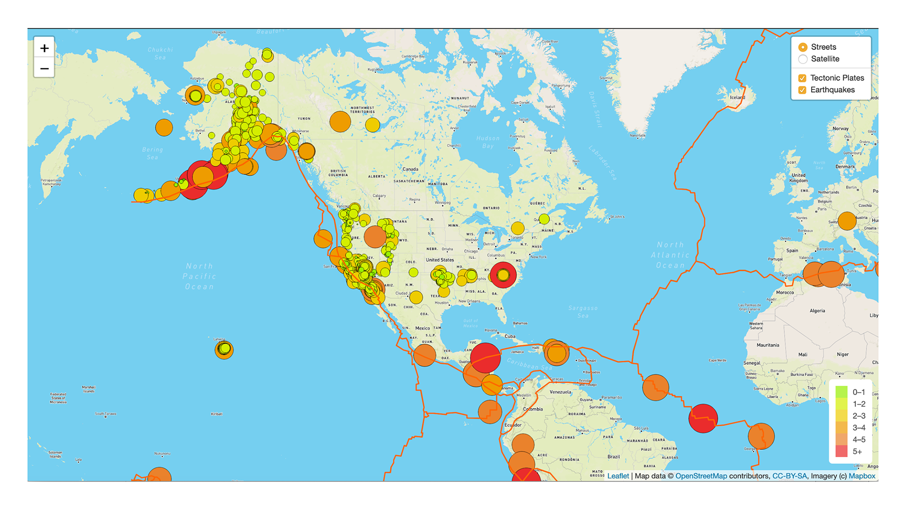

# Mapping_Earthquakes

## Background 
In this project, I used the two different earthquake maps and the earthquake overlay to display the data in relation to the tectonic plates’ location on the earth.  I displayed all the earthquakes with a magnitude greater than 4.5 on the map, and visualized that data on a third map.

### Deliverable 1
Used JavaScript, Leaflet, and geoJSON layering to add Tectonic Plate Data. Set the tectonic plate LineString data to stand out on the map, and added the tectonic plate data to the overlay object with the earthquake data.

### Deliverable 2
Add Major Earthquake Data to the map using d3.json(). Added color and set the radius of the circle based on the earthquake's magnitude. Finally, I added a popup marker for each earthquake that displays the magnitude and location of the earthquake using the GeoJSON layer, geoJSON().

### Deliverable 3
Used JavaScript and Leaflet.js to add a third map style to the earthquake maps.

